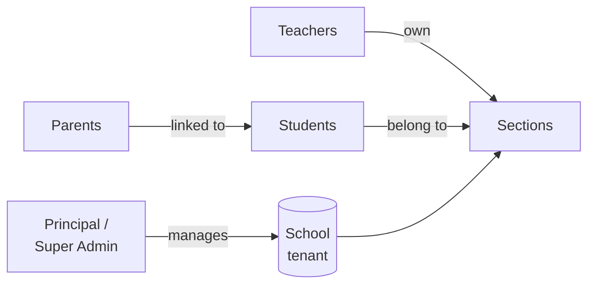
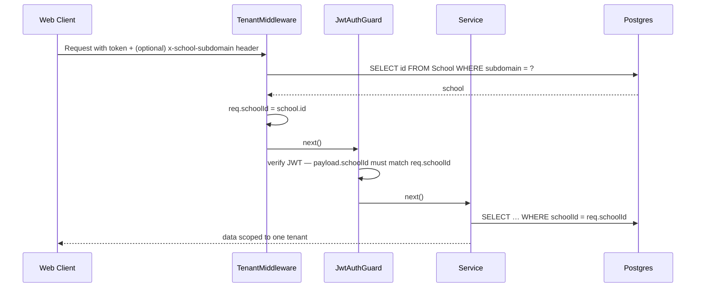
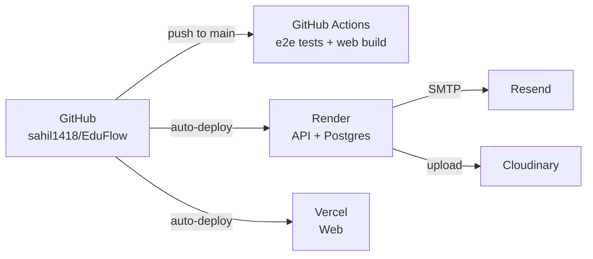

# EduFlow — Product & Engineering Documentation

> Multi-tenant school management SaaS · pilot-ready build · deployed on Render + Vercel

| | |
|---|---|
| **Version** | 0.1 (pilot) |
| **Status** | Live demo, four role portals, 12 modules implemented |
| **Repository** | https://github.com/sahil1418/EduFlow |
| **Stack** | NestJS 11 · Prisma 5 · Postgres · Next.js 16 · React 19 · Tailwind v4 · Expo 52 |

---

## How to convert this document

This file is Markdown. To share it as PDF or DOCX with reviewers, pick one route:

| Output | Easiest path |
|---|---|
| **PDF** | Open in VS Code → install **Markdown PDF** extension → right-click the file → *Markdown PDF: Export (pdf)*. Done in 3 seconds. |
| **PDF** *(no VS Code)* | Open the `.md` in Chrome / Edge / Firefox → `Ctrl+P` → Destination: *Save as PDF*. |
| **DOCX** | `pandoc DOCUMENTATION.md -o EduFlow-Documentation.docx` (one command if Pandoc is installed). |
| **HTML** | `pandoc DOCUMENTATION.md -s -o EduFlow-Documentation.html` — opens in any browser. |
| **GitHub-rendered** | Just push and open the file on GitHub. Mermaid diagrams render automatically. |

> Tip for reviewers: leave inline comments on the GitHub-rendered version. Markdown is the easiest format to collaborate on.

---

## Table of contents

1. [Executive summary](#1-executive-summary)
2. [Product overview](#2-product-overview)
3. [The four role portals](#3-the-four-role-portals)
4. [Feature matrix](#4-feature-matrix)
5. [Technical architecture](#5-technical-architecture)
6. [Data model](#6-data-model)
7. [API surface](#7-api-surface)
8. [Security & multi-tenancy](#8-security--multi-tenancy)
9. [UX details](#9-ux-details)
10. [Demo dataset](#10-demo-dataset)
11. [Deployment topology](#11-deployment-topology)
12. [Current state & roadmap](#12-current-state--roadmap)
13. [Honest caveats](#13-honest-caveats)
14. [Glossary](#14-glossary)

---

## 1. Executive summary

EduFlow is a school-management SaaS designed for Indian K-12 schools. It replaces the standard "one giant dashboard for everyone" pattern with **four distinct role portals** — Principal, Teacher, Student, Parent — each with its own URL space, sidebar, and brand colour. The same backend API serves all four, but the user experience is decentralized.

**What's done (pilot v0.1):**

- All 4 role portals built end-to-end with role-specific dashboards, navigation, and accents.
- 12 product modules implemented: authentication & onboarding, class/section management, attendance, marks & report cards, class wall (feed), real-time chat, timetable, homework & assignments, notifications, reports & analytics, fees, admin settings.
- Multi-tenancy: every school is isolated by `schoolId` on every row; subdomain → school resolution is wired but optional for pilot deploy.
- Demo seed: 1 principal, 12 teachers, 300 students (grades 9-12 with 11/12 split into Science-Math, Science-Bio, Commerce, Arts streams), 300 parents, 30 days of attendance, 20+ published mid-term exams, ~34 feed posts, 10 assignments with submissions.
- Deployed: API on **Render** (free tier + Postgres), web on **Vercel** (auto from GitHub). CI runs e2e tests on every push.
- Polish: smooth page transitions, role-themed top progress bar for in-flight requests, animated landing with rotating role text, CSV export on every important data view, print-to-PDF on report cards.

**Why it matters:** schools in India typically buy 3-5 separate tools (attendance app + marks software + WhatsApp groups for parents + fee collection portal + bus tracker). EduFlow folds the first five into one tenant-isolated platform that staff can run themselves.

---

## 2. Product overview

### Who uses it



### Core flows

| Flow | Who initiates | Where it ends |
|---|---|---|
| New school onboarding | Principal | Principal's dashboard with admin account |
| Daily roll-call | Class teacher | Parent notification + attendance records |
| Exam → marks → report card | Teacher → Principal publishes | Student/parent inbox + printable card |
| Class wall post | Teacher / Principal | Class roster sees post, can react |
| Homework cycle | Teacher → Student submits → Teacher grades | Student sees grade + feedback |
| Fee collection | Principal records payment | Parent sees paid status |

### Out of scope (intentionally)

- Online payment gateway integration (schema is ready; webhook handler parked)
- SMS gateway (email-only OTP for pilot — Twilio/MSG91 are pluggable later)
- Bus tracking / GPS
- Library management
- Exam paper authoring (only marks entry, not question banks)
- Mobile app feature parity with web (mobile is currently login + dashboard skeleton)

---

## 3. The four role portals

Each portal has its own URL prefix, its own sidebar, and a role-coded accent colour that flows through hero cards, active-nav highlights, chips, charts, and the global progress bar.

| Portal | Path | Accent | Default landing | Sidebar items |
|---|---|---|---|---|
| 🛡️ **Principal** (`SUPER_ADMIN`) | `/principal/*` | Red (`#dc2626`) | `/principal/dashboard` | Dashboard · Users · Classes · Attendance · Marks · Timetable · Class Wall · Reports · Fees · Inbox · Settings |
| 🎓 **Teacher** | `/teacher/*` | Amber (`#d97706`) | `/teacher/dashboard` | Dashboard · Attendance · Marks · Class Wall · Assignments · Timetable · Chat · Reports · Inbox |
| 👨‍🎓 **Student** | `/student/*` | Blue (`#2563eb`) | `/student/dashboard` | Today · My Attendance · Report Card · Timetable · Class Wall · Homework · Chat · Inbox · Profile |
| 👪 **Parent** | `/parent/*` | Teal (`#0d9488`) | `/parent/dashboard` | Overview · Child's Attendance · Report Card · Timetable · Class Wall · Homework · Fees · Teachers · Inbox · Profile |

### Role-tagged login pages

Marketing-friendly URLs so each role has a dedicated entry point. All four submit to the same `/auth/login` endpoint — the split is purely UX:

- `/login/principal` · `/login/teacher` · `/login/student` · `/login/parent` · `/login` (portal chooser)

A student who lands on `/login/principal` and authenticates is still redirected to their actual portal (`/student/dashboard`). The backend role gate is the source of truth.

---

## 4. Feature matrix

Module-by-role view of what each user type can do.

| Feature | 🛡️ Principal | 🎓 Teacher | 👨‍🎓 Student | 👪 Parent |
|---|:--:|:--:|:--:|:--:|
| Dashboard | School-wide | Today's classes + tasks | Today + grades + homework | Child's status |
| Users (CRUD) | ✅ | — | — | — |
| Classes & sections | CRUD | View assigned | — | — |
| Subjects | CRUD | View | — | — |
| Timetable | Create / edit | View own schedule | View own section | View child's |
| Attendance | School-wide read-only | Mark their sections | View own (calendar) | View child's (calendar) |
| Marks entry | Oversight + publish | Enter for their subjects | View own report card | View child's report card |
| Report card PDF | View any | View their students | View own | View child's |
| Class wall | School broadcasts | Post in their sections | Read their section | Read child's section |
| Class wall reactions | ✅ | ✅ | ✅ | ✅ |
| Assignments | Oversight | Create + grade | Submit + see grade | View child's status |
| Chat | All groups | Class groups + DMs | Class group + DM teachers | DM teachers |
| Reports & analytics | Full school | Their sections + activity | — | — |
| **Fees** | Manage structures + collect | — | — | View own child's |
| Settings (school profile, audit, subjects) | ✅ | — | — | — |
| Notifications inbox | ✅ + broadcast | ✅ | ✅ | ✅ |
| Leave applications | Approve | Approve for sections | Apply | Apply on behalf of child |
| CSV export | Attendance · marks · submissions | Marks · submissions | Own report card | Child's report card |

### Role-exclusive features

- **Fees**: only the Principal can create fee structures and record payments. Parents see read-only status of their child's outstanding fees.
- **Settings & audit log**: only the Principal.
- **Posting to the class wall**: only Teachers (their sections) and the Principal (school-wide).
- **School-wide broadcasts**: only the Principal.

---

## 5. Technical architecture

### High level

```mermaid
graph TB
  subgraph "Client"
    W[Next.js 16 web app<br/>4 role portals]
    M[Expo mobile<br/>login + dashboard]
  end
  subgraph "Edge / Hosting"
    V[Vercel<br/>web]
    R[Render<br/>API web service]
    DB[(Render Postgres)]
  end
  W -- HTTPS + JWT --> R
  M -- HTTPS + JWT --> R
  R -- Prisma --> DB
  W -- websocket --> R
  Resend[Resend SMTP<br/>email/OTP] <-- R
  Cloudinary[Cloudinary<br/>file uploads] <-- R
  V -. serves .- W
```

### Repository structure

```
eduflow/
├── apps/
│   ├── api/          NestJS 11 + Prisma 5 backend
│   ├── web/          Next.js 16 + React 19 + Tailwind v4 frontend
│   └── mobile/       Expo 52 + React Native (skeleton)
├── infra/
│   └── docker-compose.yml      local Postgres + Redis
├── render.yaml                  Render Blueprint
├── DOCUMENTATION.md            (this file)
├── README.md
├── DEPLOY.md
└── SEED_CREDENTIALS.md          (gitignored — local-only credentials list)
```

### API app (apps/api)

```
src/
├── main.ts                bootstrap + helmet + CORS + Swagger
├── app.module.ts
├── prisma/                global Prisma client
├── common/
│   ├── tenant.middleware.ts    subdomain → schoolId
│   └── tenant.decorator.ts     @SchoolId() @CurrentUser()
├── auth/                  register-school · login · OTP · /me · /me/children · JWT guard · role decorator
├── schools/               school profile + stats
├── classes/               classes · sections · rosters · transfers · bulk import
├── attendance/            mark · roll-call query · monthly view · defaulters · leave apps
├── marks/                 exams · enter marks · publish · class summary · student report card
├── feed/                  posts · scope CLASS|SCHOOL · pin · react · comment
├── assignments/           create · submit · grade · /my-submission · duplicates
├── chat/                  REST + Socket.IO gateway · class groups + DMs
├── timetable/             weekly grid · conflict detection · substitutions
├── notifications/         inbox · broadcast · preferences · templates
├── reports/               attendance trend · marks averages · at-risk · teacher activity
├── fees/                  structures · payments · summary · overdue reminders
├── admin/                 users CRUD · subjects · audit · parent linking
├── uploads/               Cloudinary upload endpoint
├── email/                 nodemailer + OTP/marks/absence templates
├── health/                / and /health for Render's health check
└── _test-helpers/         /_test/last-otp — only mounted when ENABLE_TEST_HELPERS=true
```

### Web app (apps/web)

```
src/
├── app/
│   ├── layout.tsx                root: Geist fonts + UserProfile + TopProgressBar
│   ├── globals.css               design tokens, animations, role chips
│   ├── page.tsx                  landing (animated)
│   ├── login/
│   │   ├── page.tsx              portal chooser
│   │   ├── principal/page.tsx
│   │   ├── teacher/page.tsx
│   │   ├── student/page.tsx
│   │   └── parent/page.tsx
│   ├── register/page.tsx         school registration
│   ├── (app)/                    legacy universal portal (fallback, will retire)
│   ├── principal/                Principal portal (11 routes)
│   ├── teacher/                  Teacher portal (9 routes)
│   ├── student/                  Student portal (9 routes)
│   └── parent/                   Parent portal (10 routes)
├── components/
│   ├── auth/LoginForm.tsx        shared role-aware login form
│   ├── common/                   UserProfile (floating pill) · PremiumLoader (circular %) · TopProgressBar
│   ├── layout/                   RolePortalShell · Sidebar (legacy) · TopBar · PageTransition
│   ├── parent/ChildHeader.tsx
│   └── ui/                       Card · Button · Input · FileUpload
└── lib/
    ├── api.ts                    fetch helper + in-flight tracker + session storage
    ├── role-config.ts            per-role sidebar items, accents, default routes
    ├── use-children.ts           parent's linked-children hook
    └── export.ts                 CSV download helper
```

### Mobile (apps/mobile)

Currently a skeleton with login + dashboard. Not deployed. Used for proving the API works from a native client. Mobile parity for the 4 role portals is on the roadmap.

---

## 6. Data model

### Tenant root + identity

- **School** — tenant root. Carries `subdomain` (unique globally), board (CBSE/ICSE/STATE/IB/OTHER), grading scale, profile.
- **AcademicYear** — per school. One marked `isCurrent: true` at a time.
- **Term** — sub-period of an academic year (Term 1, Term 2, etc).
- **User** — single table for all four roles. Carries `schoolId`, `role`, optional `email`/`phone` (unique within school), optional `password` hash, optional `sectionId` + `rollNumber` for students.
- **ParentLink** — many-to-many between PARENT and STUDENT users.
- **RefreshToken** — JWT refresh chain (unused yet — tokens are simple JWT for pilot).
- **OtpCode** — hashed OTP codes with TTL.

### Structure

- **Class** — Grade 1–12 per school per academic year.
- **Section** — A/B/C or stream codes (SCI-M, COMM, etc.). Has optional `classTeacherId`.
- **Subject** — per school, name + optional code.
- **ClassSubject** — junction. Maps a subject to a section + the teacher who teaches it.

### Operational data

- **AttendanceRecord** — one row per (student, date). Status enum: PRESENT / ABSENT / LATE / HALF_DAY / ON_LEAVE.
- **LeaveApplication** — parent or student applies, teacher/admin approves.
- **Exam** — per class, with type (UNIT_TEST/MID_TERM/FINAL/PRACTICAL/...) and optional subject. `publishedAt` controls visibility.
- **ExamMark** — per student per exam (per subject).
- **PerformanceSnapshot** — pre-aggregated p50/p95 stats (reserved for analytics, not actively computed yet).

### Communication

- **Post** — class wall entries. `scope = CLASS | SCHOOL`. Types: ANNOUNCEMENT / HOMEWORK / NOTICE / EVENT / TEST_REMINDER / ASSIGNMENT.
- **PostComment** · **PostReaction** — engagement.
- **Assignment** — 1:1 with Post (extends a post with due date + max marks + late policy).
- **Submission** — per (assignment, student). Status: PENDING / SUBMITTED / LATE / GRADED. Includes `bodyHash` for basic duplicate detection.
- **ChatGroup** + **ChatMember** + **ChatMessage** — section groups (auto) + 1:1 DMs.
- **Notification** + **NotificationPreference** + **NotificationTemplate** — per-user inbox + admin broadcasts.

### Finance

- **FeeStructure** — per class, optional `dueDate`.
- **FeePayment** — per student per structure. Status: PENDING / PAID / PARTIAL / OVERDUE.

### Cross-cutting

- **AuditLog** — append-only record of meaningful actions (who did what when).
- **Timetable** + **TimetablePeriod** + **TimetableSubstitution** — per-section weekly grid.

### Tenancy enforcement

Every operational model carries `schoolId String` + relation to `School`. Every Prisma query in the API services includes `where: { schoolId }`. The TenantMiddleware (see section 8) attaches a `schoolId` from the JWT to every request; any attempt to access another school's data is blocked at the service layer.

---

## 7. API surface

JSON over HTTPS, JWT bearer tokens, prefix-less paths (each module owns its route prefix). Swagger UI auto-mounted at `/docs` in non-production (or when `ENABLE_SWAGGER=true`).

### Auth & session

| Method | Path | Roles | Purpose |
|---|---|---|---|
| POST | `/auth/register-school` | (public) | Create school + initial SUPER_ADMIN |
| POST | `/auth/login` | (public) | Email + password → JWT |
| POST | `/auth/otp/request` | (public) | Email-based OTP issue |
| POST | `/auth/otp/verify` | (public) | OTP → JWT |
| GET | `/auth/me` | any | Decoded JWT payload |
| GET | `/auth/me/children` | PARENT | Linked students for the current parent |

### School / tenancy

| Method | Path | Roles | Purpose |
|---|---|---|---|
| GET | `/school` | any | Current school details |
| PATCH | `/school` | SUPER_ADMIN | Update profile |
| GET | `/school/stats` | any | Aggregate counts + today's attendance |

### Class & section management

| Method | Path | Roles | Purpose |
|---|---|---|---|
| GET | `/classes` | any | All classes + sections for current year |
| POST | `/classes` | SUPER_ADMIN | Create class |
| POST | `/classes/:id/sections` | SUPER_ADMIN | Create section |
| POST | `/sections/:id/class-teacher` | SUPER_ADMIN | Assign class teacher |
| GET | `/sections/:id/students` | any | Section roster |
| POST | `/sections/:id/students` | SUPER_ADMIN, TEACHER | Add student |
| POST | `/sections/:id/students/import` | SUPER_ADMIN | Bulk CSV-equivalent |
| POST | `/students/:id/transfer` | SUPER_ADMIN | Move to another section |

### Attendance

| Method | Path | Roles | Purpose |
|---|---|---|---|
| GET | `/attendance/section/:id?date=` | any | Today's roll-call |
| POST | `/attendance/section/:id/mark` | SUPER_ADMIN, TEACHER | Bulk mark |
| GET | `/attendance/student/:id/month?month=` | any | Monthly calendar |
| GET | `/attendance/defaulters?threshold=` | SUPER_ADMIN, TEACHER | At-risk list |
| POST | `/attendance/leaves` | any | Apply leave |
| PATCH | `/attendance/leaves/:id` | SUPER_ADMIN, TEACHER | Approve/reject |
| GET | `/attendance/leaves?status=` | any | List leaves |

### Marks & report cards

| Method | Path | Roles | Purpose |
|---|---|---|---|
| GET / POST | `/exams` | … / SA + T | List / create exam |
| GET | `/exams/:id` | any | Detail + roster + marks |
| POST | `/exams/:id/marks` | SA + T | Enter/update marks |
| POST | `/exams/:id/publish` | SA + T | Make visible to students/parents |
| GET | `/exams/:id/summary` | any | Class average, top/bottom |
| GET | `/students/:id/report-card` | any | Cumulative report card |

### Class wall (feed)

| Method | Path | Roles | Purpose |
|---|---|---|---|
| GET | `/feed?sectionId=&type=` | any | Posts (auto-filtered for students/parents) |
| POST | `/feed` | SA + T | Create post |
| PATCH | `/feed/:id/pin` | SA + T | Pin/unpin |
| POST | `/feed/:id/comments` | any | Comment |
| POST/DEL | `/feed/:id/react` | any | Add/remove reaction |

### Assignments

| Method | Path | Roles | Purpose |
|---|---|---|---|
| GET | `/assignments?sectionId=` | any | List |
| POST | `/assignments` | SA + T | Create (also creates a Post of type ASSIGNMENT) |
| GET | `/assignments/:id` | any | Detail |
| GET | `/assignments/:id/submissions` | SA + T | All submissions + grading state |
| GET | `/assignments/:id/my-submission` | STUDENT | Caller's own submission (or null) |
| POST | `/assignments/:id/submit` | STUDENT | Submit/re-submit (upsert) |
| POST | `/assignments/submissions/:id/grade` | SA + T | Grade |
| GET | `/assignments/:id/duplicates` | SA + T | Basic plagiarism detection (bodyHash) |

### Chat (REST + WebSocket)

| Method | Path | Purpose |
|---|---|---|
| GET | `/chat/groups` | My groups |
| POST | `/chat/groups/section/:id` | Ensure section group exists |
| GET | `/chat/groups/:id/messages` | History |
| POST | `/chat/groups/:id/messages` | Send (also broadcast via WS) |
| POST | `/chat/direct/:userId` | Open/find DM |

WebSocket namespace at `/chat`. Authenticates via JWT in handshake `auth.token`.

### Timetable

| Method | Path | Purpose |
|---|---|---|
| GET | `/timetable/section/:id` | Read |
| PUT | `/timetable/section/:id` | Replace (with cross-section conflict detection) |
| POST | `/timetable/periods/:id/substitute` | Substitute teacher for a date |
| GET | `/timetable/student/:id` | Student's own section's timetable |

### Notifications

| Method | Path | Purpose |
|---|---|---|
| GET | `/notifications?unread=` | Inbox |
| GET | `/notifications/unread-count` | Badge counter |
| PATCH | `/notifications/:id/read` | Mark read |
| POST | `/notifications/read-all` | Mark all |
| POST | `/notifications/broadcast` (SUPER_ADMIN) | Broadcast to role or ALL |
| GET / PATCH | `/notifications/preferences` | Per-user channel preferences |

### Reports

| Method | Path | Purpose |
|---|---|---|
| GET | `/reports/attendance?days=` | 30-day series |
| GET | `/reports/marks` | Published exam averages |
| GET | `/reports/at-risk` | Students below thresholds |
| GET | `/reports/teacher-activity` | 30-day leaderboard |

### Fees

| Method | Path | Roles | Purpose |
|---|---|---|---|
| GET / POST | `/fees/structures` | … / SUPER_ADMIN | List / create structure |
| GET | `/fees/class/:classId` | any | Per-class breakdown |
| GET | `/fees/student/:studentId` | any | Per-student status |
| POST | `/fees/payments/:id` | SUPER_ADMIN | Record payment |
| POST | `/fees/overdue-remind` | SUPER_ADMIN | Bulk reminder to parents |
| GET | `/fees/summary` | SUPER_ADMIN | School-wide totals |

### Admin (Principal only)

| Method | Path | Purpose |
|---|---|---|
| GET / POST | `/admin/users` | List / create users (any role) |
| POST | `/admin/users/import` | Bulk import |
| PATCH | `/admin/users/:id` | Update |
| PATCH | `/admin/users/:id/active` | Activate / deactivate |
| POST | `/admin/parent-link` | Link a parent to a student |
| GET / POST | `/admin/subjects` | Subject catalogue |
| GET | `/admin/audit` | Recent audit log |

### Health & test helpers

| Method | Path | Purpose |
|---|---|---|
| GET | `/` | Root info (mounted always) |
| GET | `/health` | DB ping for Render health check |
| GET | `/_test/last-otp?identifier=` | Plaintext OTP retrieval. **Only mounted when `ENABLE_TEST_HELPERS=true`**. Used by CI; refuses with 403 otherwise. |

---

## 8. Security & multi-tenancy

### Authentication

- **JWT bearer tokens** with `{ sub, role, schoolId }` payload.
- Two auth paths:
  - **Password** (email + password) — for staff (Principal, Teachers) and adults.
  - **Email OTP** — for parents primarily; also a fallback for anyone. OTPs are 6-digit, hashed at rest, 5-minute TTL, single-use.
- Bcrypt password hashing (10 rounds) — `bcryptjs`-compatible swap available if native `bcrypt` causes Windows build issues.

### Authorization

- **Class-level guards**: `JwtAuthGuard` (token required) + `RolesGuard` (role allowlist via `@Roles(Role.X, Role.Y)` decorator) applied per controller.
- **Tenant guard** at request layer: the JWT payload's `schoolId` becomes `req.schoolId`. If a subdomain is also provided, it must match the token's school; otherwise 401.
- **Query-level enforcement**: every Prisma query in service code filters by `schoolId` from `@SchoolId()`. Composite uniques don't span schools.

### Multi-tenancy resolution



Subdomain detection is **opt-in via `ROOT_DOMAIN` env var**. If unset (current Vercel deploy), subdomain parsing is disabled and tenants are resolved purely from the `x-school-subdomain` header sent by the web client from localStorage. This avoids the IPv4 / API-host false-positive that took out the early deploy.

### CSRF & input

- Helmet middleware.
- `class-validator` ValidationPipe with `whitelist: true, forbidNonWhitelisted: true` so unexpected fields are rejected.
- CORS origin allowlist via `CORS_ORIGINS` env var, with `*.vercel.app` always allowed for preview deploys.

### Surface that's *not* hardened yet

See [§13 Honest caveats](#13-honest-caveats).

---

## 9. UX details

### Design tokens

- **Light theme**, slate-50 base with three radial-orb gradients (indigo, teal, amber) for ambient depth.
- **Glassmorphic surfaces**: `rgba(255,255,255,0.85)` + `backdrop-filter: blur(12px)` for cards.
- **Brand**: indigo `#4f46e5` → teal `#14b8a6` gradient on the primary mark and CTAs.
- **Role accents**:
  - Admin: red `#dc2626`
  - Teacher: amber `#d97706`
  - Student: blue `#2563eb`
  - Parent: teal `#0d9488`
- **Eyebrow labels**: `text-transform: uppercase; letter-spacing: 0.16em;` — used everywhere for section/category labels (CivicLoop pattern, ported to light).
- **Pill chips**: `border-radius: 999px;` with tracking-widest uppercase content; role-coloured variants `ef-role-admin/teacher/student/parent`.
- **Typography**: Geist Sans + Geist Mono via `next/font/google`.

### Page transitions

- Every navigation triggers a fade-up + stagger via `PageTransition` (`apps/web/src/components/layout/PageTransition.tsx`). The wrapper is keyed by `usePathname()` so children remount and replay the `page-enter` keyframes.
- Children inside a `.page-enter` get incremental delays (30 → 80 → 130 → 180 → 220 → 260 → 300 ms) for a polished staircase effect.
- Honours `prefers-reduced-motion: no-preference` — animation is gated by that media query.

### Global progress bar

- Slim 2-px bar pinned to top of viewport.
- Subscribes to a request counter in `lib/api.ts` (`pendingRequests()`).
- 300 ms threshold: bar appears only if a request is taking longer than that. Sub-second requests stay invisible.
- Bar fills 15 → 80% in ~600 ms, crawls 80 → 95% while still pending, snaps to 100% on settle, fades out.
- Colour follows the signed-in user's role accent (indigo if not signed in).

### Loaders

- **`PremiumLoader`**: full-screen, used during role-gate / auth check at portal entry. Circular SVG gradient ring + animated percentage 0–95%, orbiting white dot, pulsing halo, cycling phase text.
- **Inline spinners / skeletons**: per-page, where applicable. Pages with multiple async calls show partial cards as data arrives.

### Print

- Report card pages on both `/student/marks` and `/parent/marks` are designed to print cleanly: the floating UserProfile pill, sidebar, and edit controls are hidden via `print:hidden`; the card itself fills the page with school header, exam tables, footer.

### Exports

| Where | What's exported |
|---|---|
| Student/Parent report card → **CSV** | All published exam rows: Exam, Type, Date, Subject, Marks, Max, Grade, Remarks |
| Marks entry (any role) → **CSV** | Section roster + entered marks + auto-computed percentage |
| Assignment detail (teacher/admin) → **CSV** | Per-student: roll, name, status, late, submitted-at, grade, feedback, body length |
| Principal attendance → **CSV** | Per-section summary for selected date: roll, present, absent, late, half-day, pending, % |

All CSVs include a UTF-8 BOM so Excel opens diacritics cleanly.

---

## 10. Demo dataset

The `pnpm prisma:seed` script (`apps/api/prisma/seed.ts`) populates a complete demo school. Idempotent: re-running wipes derived data and rebuilds.

| Entity | Count | Notes |
|---|---|---|
| School | 1 | "Springfield Public School" · subdomain: `springfield` |
| Principal | 1 | `principal@springfield.eduflow.local` / `principal123` |
| Teachers | 12 | Each with a primary subject. Password `teacher123` for all. |
| Students | 300 | 30 per section × 10 sections. Password `student123` for all. |
| Parents | 300 | Each linked to one student. Password `parent123` (or email OTP). |
| Subjects | 16 | Math, English, Science, Hindi, CS, PE, and stream-specific (Physics, Chem, Bio, Accountancy, Business Studies, Economics, History, Geography, Political Science). |
| Classes | 4 | Grades 9, 10, 11, 12. |
| Sections | 10 | 9A, 10A, 11 × {SCI-M, SCI-B, COMM, ARTS}, 12 × same 4 streams. |
| Class-subject assignments | ~50 | Each section's curriculum mapped to a teacher. |
| Timetable | 300 | 5 days × 6 periods × 10 sections. |
| Attendance | ~6 600 | Last 30 weekdays, ~92% present / 4% absent / 3% late / 1% half-day. |
| Exams | 20+ | Mid-term Mathematics + English where offered, all published. |
| Feed posts | 34 | 4 school-wide announcements (pinned) + 3 class posts per section. |
| Assignments | 10 | One per section, with ~21 student submissions each (mix of submitted-only and graded). |

Credentials are also enumerated in `SEED_CREDENTIALS.md` (gitignored).

---

## 11. Deployment topology



| Service | Provider | Tier | Purpose |
|---|---|---|---|
| API | Render Web Service | Free | NestJS, autosleep after 15 min idle |
| Database | Render Postgres | Free | 90-day expiry on free tier |
| Web | Vercel | Hobby | Auto-deploys on push to main |
| Email | Resend | 100/day free | OTP, marks-published, absence alerts |
| Files | Cloudinary | 25 GB free | Class wall attachments, assignment files |
| CI | GitHub Actions | Free | E2E tests + web build, runs on every PR |

### Render Blueprint

`render.yaml` at repo root provisions everything. Build command:

```bash
corepack enable && corepack prepare pnpm@9.0.0 --activate &&
pnpm install --no-frozen-lockfile &&
pnpm exec prisma generate &&
pnpm exec prisma db push --accept-data-loss --skip-generate &&
pnpm build
```

Start command:

```bash
pnpm start:prod
```

> **Note**: `prisma db push` (not `migrate deploy`) is used for the pilot because we ship no migration files. Switch to migrations before production data exists.

### Vercel config

- Root directory: `apps/web`
- Framework preset: Next.js (auto)
- Environment: `NEXT_PUBLIC_API_BASE` pointing at the Render URL

### Environment variables (Render)

| Key | Default | Notes |
|---|---|---|
| `DATABASE_URL` | (from Render Postgres) | Auto-wired by Blueprint |
| `JWT_SECRET` | (Render generates) | Auto |
| `JWT_EXPIRES_IN` | `7d` | |
| `NODE_ENV` | `production` | |
| `ENABLE_SWAGGER` | `false` | Set `true` to expose `/docs` in prod |
| `ENABLE_TEST_HELPERS` | `false` | **MUST be false in production** — exposes plaintext OTPs |
| `CORS_ORIGINS` | (empty) | Comma-separated. Empty = allow all. `*.vercel.app` always allowed. |
| `ROOT_DOMAIN` | (empty) | If set, enables subdomain-based tenancy. Pilot doesn't need this. |
| `SMTP_HOST/PORT/USER/PASS/FROM` | (empty) | Resend or any SMTP provider. Empty = emails logged, not sent. |
| `CLOUDINARY_CLOUD_NAME/API_KEY/API_SECRET` | (empty) | Empty = uploads return 400, rest of app still works. |

---

## 12. Current state & roadmap

### What's complete

- ✅ All 12 modules functional end-to-end
- ✅ 4 role portals with dedicated dashboards + sidebars
- ✅ Multi-tenancy enforced at query level
- ✅ Demo seed (300 students + 12 teachers + 300 parents + 30 days attendance + published exams + posts + assignments)
- ✅ Email (Resend) wired through nodemailer
- ✅ File uploads (Cloudinary)
- ✅ Real-time chat (Socket.IO)
- ✅ Print-to-PDF report cards
- ✅ CSV exports on key data views
- ✅ Smooth page transitions + role-themed global progress bar
- ✅ Dynamic landing page with rotating role text + floating preview card
- ✅ Animated PremiumLoader with circular percentage ring
- ✅ Live student-submission status (Submit / Submitted / Graded states)
- ✅ Auth: register-school + password login + email-OTP login + role-tagged portal entry
- ✅ Live deploy: Render API + Vercel web + GitHub Actions CI

### What's intentionally deferred

- 🟡 Razorpay/Stripe webhook for online fee payment (schema ready; handler parked)
- 🟡 SMS gateway (Twilio/MSG91) — email-only OTP for pilot
- 🟡 Mobile app feature parity (currently login + dashboard skeleton)
- 🟡 Migration from `prisma db push` to proper migrations
- 🟡 Custom wildcard domain (`*.eduflow.app`) for true subdomain tenancy

### What's broken or not yet built

- ❌ Self-serve password change (parents/students must ask the school office)
- ❌ Avatar upload for users (only school logo via Cloudinary)
- ❌ Bulk CSV import UI for students/teachers (API supports it; no web form yet)
- ❌ Half-day attendance UI affordance (data model supports HALF_DAY; only available via mass-marking)
- ❌ Report card school logo + signature blocks in print view
- ❌ Push notifications (in-app inbox only; no FCM/APNs)
- ❌ Audit log filtering / search (just last 200 events)

### Roadmap (suggested priority for v0.2)

1. **Production hardening**: switch to real Prisma migrations, add request-level rate limiting per IP, harden CORS to known domains only, set up domain + wildcard DNS.
2. **Mobile app role portals**: same decentralization model on Expo.
3. **Online fees**: Razorpay webhook + receipt generation.
4. **Self-service**: password change, profile-photo upload, parent profile edits.
5. **Reports v2**: per-section attendance trend, individual student trend across exams, exportable PDF report packs.

---

## 13. Honest caveats

These are real and worth flagging to reviewers before they encounter them:

### Operational

- **Render free tier sleeps after 15 minutes idle.** First request after sleep takes 30–60 s — the global progress bar will sit near 95% the whole time. Mention this to pilot users or upgrade to Render Starter ($7/mo).
- **Render free Postgres expires after 90 days.** Need to manually take a backup and re-provision, or upgrade to a paid plan.
- **No proper migrations yet.** `prisma db push` is used for the pilot. Once real data exists, switching to migrations is a controlled, mandatory step before any further schema change.
- **`pnpm-lock.yaml` is not committed.** Each deploy (Render/Vercel/CI) generates its own lockfile. Slightly less reproducible, but unblocked the no-local-install workflow.

### Security

- **OTP delivery is email-only.** SMS path exists in code but only logs to console. Fine for staff + most parents; needs a real SMS provider before scale.
- **Resend test mode** can only send to verified email addresses unless a custom domain is verified in Resend. Pilot users not in the verified list won't get OTPs.
- **`ENABLE_TEST_HELPERS`** exposes plaintext OTPs. We pin it to `false` in `render.yaml`. Verifying nobody sets it to `true` in production is essential.
- **No CSRF protection** on the API (cookies aren't used for auth; bearer tokens make CSRF mostly irrelevant — but if cookie-auth is added later, double-check).
- **No rate limiting per IP.** `@nestjs/throttler` is wired with a per-route default of 120 req/min — fine for honest traffic, but a determined attacker could still drain Resend's daily quota or hammer login. Real limits + IP allowlists belong in front of the API (Cloudflare, Render rate-limits).

### Code quality

- **Many legacy `(app)/*` routes are still in the repo.** They're re-exported from the role portals and serve as fallbacks. They'll be retired in cleanup once the 4 role portals are 100% click-through tested.
- **`middleware.ts` is deprecated in Next 16** (should be renamed to `proxy.ts`). Currently shouts a warning at every build. One-line fix later.
- **TypeScript on the API is loose** — `strict: false` and many `any` types in route handlers. Acceptable for pilot velocity; would tighten with proper DTOs before scale.
- **No request-level deduplication.** Two parallel requests to the same endpoint will both fire. React Query / SWR would fix this; not adopted to keep dep count low.

### Honest scope gaps

- **No "parent of multiple children" support visually proven** — the `useChildren()` hook supports it (`ChildHeader` has a switcher) but the seed only links one child per parent, so the switcher is untested with real data.
- **The `Sidebar.tsx` in `components/layout/` is legacy** — only used by `(app)/layout.tsx`. The role portals use `RolePortalShell` which has its own internal sidebar. Two sidebars in the codebase.
- **`bcryptjs` vs `bcrypt`**: package.json uses `bcrypt` (native). On Windows local dev this fails to build. Render's Linux build works fine. If a reviewer tries to run locally on Windows: swap to `bcryptjs` (drop-in API-compatible).

---

## 14. Glossary

| Term | Meaning |
|---|---|
| **Tenant** | One school. Identified by `schoolId`. Every row in operational tables carries `schoolId`. |
| **Subdomain** | `springfield.eduflow.app`-style URL where the host's first label maps to a tenant. Optional for the pilot deploy. |
| **Role portal** | A URL-prefixed area of the app dedicated to one of the 4 roles (`/principal`, `/teacher`, `/student`, `/parent`). |
| **Class teacher** | The single teacher responsible for a section (marks attendance, primary contact). One per section. |
| **Class subject** | A junction row linking a subject to a section, with the teacher who teaches it. |
| **Stream** | Grade 11–12 specialisation: SCI-M (Science-Maths), SCI-B (Science-Biology), COMM (Commerce), ARTS. |
| **Roll number** | A school-local identifier for a student within a section. Pattern in this seed: `<grade><sectionCode><nn>`, e.g. `10A01`, `12COMM27`. |
| **Eyebrow label** | The uppercase tracking-widest small text used above section titles throughout the UI. |
| **Glassmorphic** | The semi-transparent + backdrop-blur card style. |
| **OTP** | One-Time Password, 6 digits, 5-minute TTL, used by parents and as a fallback for anyone. |
| **Page transition** | The fade-up animation that fires on every route change. |
| **Top progress bar** | The 2-px role-themed bar at the top of the viewport during any in-flight API request (>300 ms). |
| **PremiumLoader** | The full-screen circular percentage loader shown during portal entry / auth check. |
| **Seed** | A script that wipes and rebuilds the demo school. See `SEED_CREDENTIALS.md`. |
| **Re-export** (route) | A short stub `export { default } from '@/app/(app)/.../page'` so a role portal route reuses the legacy implementation. |

---

## Appendix A — Live demo

| Surface | URL |
|---|---|
| Web (Vercel) | `https://<your-vercel-deployment>.vercel.app` |
| API (Render) | `https://<your-render-service>.onrender.com` |
| API health | `https://<your-render-service>.onrender.com/health` |
| Subdomain (demo) | `springfield` (entered in the login form, not a real DNS subdomain yet) |

Login as Principal: `principal@springfield.eduflow.local` / `principal123`.
For other sample credentials, see `SEED_CREDENTIALS.md`.

## Appendix B — Quick file map for reviewers

| To review… | Look at |
|---|---|
| Overall API entrypoint + middleware | `apps/api/src/main.ts` + `apps/api/src/common/tenant.middleware.ts` |
| Database schema | `apps/api/prisma/schema.prisma` |
| Multi-tenancy enforcement (sample) | `apps/api/src/marks/marks.service.ts` (every query is `where: { schoolId }`) |
| Auth | `apps/api/src/auth/{auth.service,auth.controller,jwt.guard,roles.guard}.ts` |
| Demo seed | `apps/api/prisma/seed.ts` |
| Role configuration | `apps/web/src/lib/role-config.ts` |
| Role portal shell | `apps/web/src/components/layout/RolePortalShell.tsx` |
| Landing page | `apps/web/src/app/page.tsx` |
| Login form (shared) | `apps/web/src/components/auth/LoginForm.tsx` |
| Page transition | `apps/web/src/components/layout/PageTransition.tsx` |
| Top progress bar | `apps/web/src/components/common/TopProgressBar.tsx` |
| Premium loader | `apps/web/src/components/common/PremiumLoader.tsx` |
| Deploy guide | `DEPLOY.md` |
| Render config | `render.yaml` |
| CI config | `.github/workflows/ci.yml` |

---

*End of document.*
